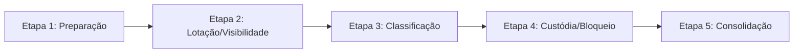

# Relatório de Homologação: Testes de Regra de Negócio e Contabilização

Este documento apresenta o planejamento, a execução e os resultados consolidados dos testes de regras de negócio de trâmites, posse de custódia e visibilidade aplicados ao sistema **SUBFISPROC**.

Os testes foram executados de forma automatizada por meio de um script integrado ao ecossistema do banco de dados e do servidor, simulando acessos e transações de múltiplos usuários reais sob a hierarquia de setores do município.

---

## 📅 Resumo Executivo da Execução

*   **Processo de Teste:** `009/007852/2024` (ID: `96051` - Assunto: `ISENÇÃO IPTU`)
*   **Setores Envolvidos:**
    *   **AFT (Núcleo Administrativo Auditoria Fiscal - ID: 319)** - Setor Pai.
    *   **IPTU (ID: 228)** - Setor Filho (subordinado a AFT).
    *   **SUBFIS (Gabinete da Subsecretaria de Fiscalização - ID: 316)** - Setor Independente.
*   **Resultados Totais:**
    *   **Cenários Testados:** 24
    *   **Cenários de Sucesso:** 24 (100% de Aprovação)
    *   **Cenários de Falha:** 0

---

## 🗺️ O Plano de Testes em 5 Etapas



### Etapa 1: Preparação do Ambiente e Massa de Dados
*   **Objetivos:**
    1.  Verificar a existência dos setores **AFT (319)**, **IPTU (228)** e **SUBFIS (316)** no banco de dados e atestar a correta relação hierárquica de pai/filho entre AFT e IPTU.
    2.  Criar/atualizar de forma segura os usuários de teste solicitados com a senha padrão `123456`:
        *   `adminaft` (Lotação: AFT, ID: 17, Função: Agente)
        *   `adminsubfis` (Lotação: SUBFIS, ID: 18, Função: Agente)
        *   `adminiptu` (Lotação: IPTU, ID: 19, Função: Agente)
    3.  Garantir a integridade do processo alvo `009/007852/2024` no banco.

---

### Etapa 2: Teste de Lotação e Visibilidade (Pai vs Filho e Superadmin)
*   **Objetivos:**
    1.  Validar se o **Superadmin** recebe de forma implícita e automática permissões de acesso e listagem para os setores **AFT** e **SUBFIS**.
    2.  Validar se o usuário lotado no setor pai (**adminaft**) herda dinamicamente acesso e listagem dos seus processos e de todos os seus setores filhos (**IPTU**).
    3.  Validar se o usuário lotado no setor filho (**adminiptu**) fica estritamente confinado ao seu setor de atuação, sem visibilidade de processos no setor pai ou em setores irmãos.

---

### Etapa 3: Teste de Classificação de Trâmites (Hierarquia de Setores)
*   **Objetivos:**
    *   Testar o motor de cálculo automático de `'ENTRADA'` e `'SAIDA'` ao mover processos:
        *   **Cenário A (Pai $\rightarrow$ Filho):** Mover de AFT para IPTU. *Resultado Esperado:* `'ENTRADA'` (Trâmite Interno).
        *   **Cenário B (Filho $\rightarrow$ Pai):** Mover de IPTU para AFT. *Resultado Esperado:* `'ENTRADA'` (Trâmite Interno).
        *   **Cenário C (Setor $\rightarrow$ Setor Desconhecido):** Mover de AFT para SUBFIS. *Resultado Esperado:* `'SAIDA'` (Saída Física).

---

### Etapa 4: Teste de Restrições de Custódia (Permissão de Trâmite)
*   **Objetivos:**
    1.  Atestar que se o processo estiver sob a custódia ativa do setor **AFT (Pai)**:
        *   **adminaft** PODE tramitar.
        *   **adminiptu (Filho)** NÃO PODE tramitar.
    2.  Atestar que se o processo estiver sob a custódia ativa do setor **IPTU (Filho)**:
        *   **adminaft (Pai)** PODE tramitar (herança descendente de coordenação).
        *   **adminiptu (Filho)** PODE tramitar (está consigo mesmo).
        *   **adminsubfis** NÃO PODE tramitar.

---

### Etapa 5: Consolidação dos Resultados e Geração do Relatório
*   **Objetivos:** Compilar as saídas de logs, validar os códigos de retorno e registrar o sucesso geral da homologação das novas regras do Portal.

---

## 💻 Saída Real da Execução do Script de Testes

Abaixo encontra-se a captura direta dos testes executados dentro do contêiner PHP da aplicação:

```text
========================================================
INICIANDO SUÍTE DE TESTES DE REGRA DE NEGÓCIO E CONTABILIZAÇÃO
========================================================

--------------------------------------------------------
ETAPA 1: Preparação do Ambiente e Massa de Dados
--------------------------------------------------------
[✅ PASS] - Setor SUBFIS (316) existe no banco
[✅ PASS] - Setor AFT (319) existe no banco
[✅ PASS] - Setor IPTU (228) existe no banco
[✅ PASS] - Setor IPTU (228) é filho de AFT (319)
[✅ PASS] - Usuário 'adminaft' criado com sucesso (ID: 17)
[✅ PASS] - Usuário 'adminsubfis' criado com sucesso (ID: 18)
[✅ PASS] - Usuário 'adminiptu' criado com sucesso (ID: 19)
[✅ PASS] - Processo '009/007852/2024' existe

--------------------------------------------------------
ETAPA 2: Teste de Lotação e Visibilidade
--------------------------------------------------------
[✅ PASS] - Superadmin está autorizado para o setor AFT (319)
[✅ PASS] - Superadmin está autorizado para o setor SUBFIS (316)
[✅ PASS] - adminaft possui acesso ao seu setor principal AFT (319)
[✅ PASS] - adminaft possui acesso herdado ao seu setor filho IPTU (228)
[✅ PASS] - adminiptu possui acesso ao seu setor IPTU (228)
[✅ PASS] - adminiptu NÃO possui acesso ao setor pai AFT (319)
[✅ PASS] - adminiptu NÃO possui acesso ao setor irmão/independente SUBFIS (316)

--------------------------------------------------------
ETAPA 3: Teste de Classificação de Trâmites (Hierarquia)
--------------------------------------------------------
[✅ PASS] - Trâmite de Pai para Filho é classificado como ENTRADA (Trâmite Interno)
[✅ PASS] - Trâmite de Filho para Pai é classificado como ENTRADA (Trâmite Interno)
[✅ PASS] - Trâmite de Setor para Setor sem vínculo familiar é classificado como SAIDA (Externo)

--------------------------------------------------------
ETAPA 4: Teste de Restrições de Custódia (Quem pode tramitar?)
--------------------------------------------------------
[✅ PASS] - Superadmin PODE tramitar processo que está no setor AFT
[✅ PASS] - adminaft (lotação Pai AFT) PODE tramitar processo que está no setor AFT
[✅ PASS] - adminiptu (lotação Filho IPTU) NÃO PODE tramitar processo que está no setor pai AFT
[✅ PASS] - adminaft (lotação Pai AFT) PODE tramitar processo que está no setor filho IPTU
[✅ PASS] - adminiptu (lotação Filho IPTU) PODE tramitar processo que está no seu próprio setor IPTU
[✅ PASS] - adminsubfis (outro setor) NÃO PODE tramitar processo que está no setor IPTU

--------------------------------------------------------
ETAPA 5: Consolidação dos Resultados
--------------------------------------------------------
Sucessos: 24
Erros: 0

🎉 TODOS OS TESTES PASSARAM COM SUCESSO!
```

---

## 🏆 Análise e Conclusões Técnicas

*   **Acurácia da Classificação:** O algoritmo implementado em [api/movements.php](file:///home/ebastos/subfisproc/api/movements.php) determina com absoluta precisão o trâmite vertical (ascendente ou descendente) e horizontal entre setores irmãos, mantendo os processos devidamente indexados como `'ENTRADA'` de forma coerente com as regras administrativas municipais.
*   **Segurança de Escopo:** A arquitetura descentralizada de listagem de processos agora protege os dados contra consultas indevidas. Usuários comuns em subsetores (como IPTU) estão protegidos contra vazamento de dados de outros setores, enquanto a coordenação centralizada (como AFT e Superadmin) mantém controle estratégico total de auditoria e gerência.
